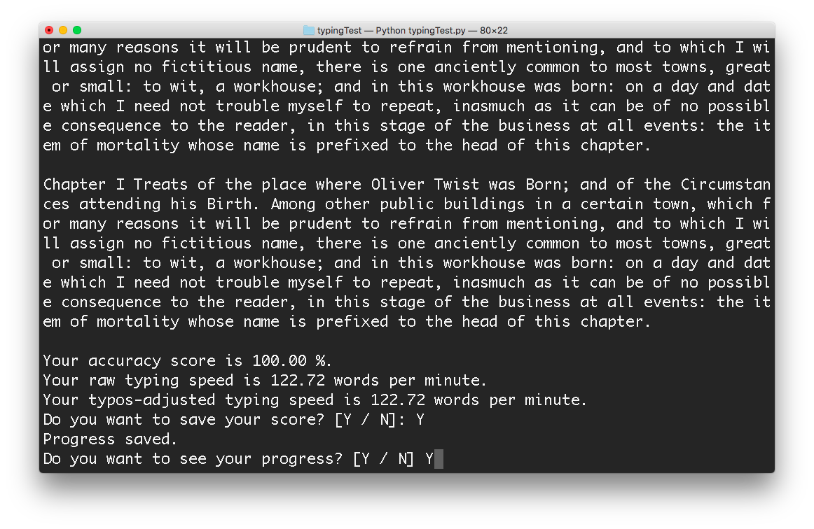

<!--
***Thank you for checking out my project. I am open to any suggestions for improvement.
***Please fork the repository and create a pull request or open an issue with the
***tag "improvement".
-->

# Timed Typing Test

<br />
<p align="center">
  <a href="https://github.com/reoyamanaka/timed_typing_test.git">
    
  </a>

  <h3 align="center">Timed Typing Test</h3>

  <p align="center">
    A Python console app that assesses typing speed and accuracy.
    <br />
    <a href="https://github.com/reoyamanaka/timed_typing_test.git"><strong>Explore the docs »</strong></a>
    <br />
    <br />
    <a href="https://youtu.be/7h0hKpCxUL8">View Demo</a>
    .
    <a href="https://github.com/reoyamanaka/timed_typing_test/issues">Report Bug</a>
  </p>
</p>

<!-- Table of Contents -->

* [About the Project](#about-the-project)
  * [Built with](#built-with)
* [Getting Started](#getting-started)
  * [Prerequisites](#prerequisites)
  * [Installation](#installation)
* [Usage](#usage)
* [Contributing](#contributing)
* [License](#license)


## About The Project

<p align="center">
  <strong>Initial Prompt</strong>
  
</p>

<p align="center">
  <strong>Excerpt to Type under Timed Conditions</strong>
  
</p>

<p align="center">
  <strong>Results</strong>
  
  
</p>

### Built With

* Python 3.8.1
* IDLE 3.8.1
* macOS High Sierra Version 10.13.6

## Getting Started

To get a local copy up and running follow these simple steps.

### Prerequisite

* matplotlib
```sh
pip install matplotlib
```

### Installation

1. Clone the repository
```sh
git clone https://github.com/reoyamanaka/timed_typing_test.git
```
2. Install matplotlib module
```sh
pip install matplotlib
```
3. Launch typingTest.py


## Usage

<div align="center">
  <strong>YouTube Demo</strong><br>
  <a href="https://youtu.be/7h0hKpCxUL8">
    
  </a>
</div>

## Contributing

I would greatly appreciate any contributions.

1. Fork the Project
2. Create your Feature Branch (`git checkout -b feature/CoolFeature`)
3. Commit your Changes (`git commit -m 'Added some CoolFeature'`)
4. Push to the Branch (`git push origin feature/CoolFeature`)
5. Open a Pull Request


## License

Distributed under the GNU Affero General Public License v3.0 License. See `LICENSE` for more information.


## Contact

Reo Yamanaka - [LinkedIn](https://www.linkedin.com/in/reo-yamanaka-7a2289119/) - [My YouTube channel](https://www.youtube.com/channel/UCBwqp_MEM2XcSnq7kRvOB3A) - ryamanaka807@gmail.com

Project Link: [https://github.com/reoyamanaka/timed_typing_test](https://github.com/reoyamanaka/timed_typing_test)
